<p align="center">
  
</p>

`Human written:`

# unclop

This tool is designed to unslop your codebase to remove unintelligible slop that claude especially likes to push out.

Each `uslop next` call gives a coding agent a chunk of items (identifiers, comments, strings) at a time with a specific prompt on how to unslop them. The agent edits the source and then calls the CLI with the identifiers to markoff that they're done. `uslop next` gives the next chunk when all is done.

The prompt for unslopping is in the config file at `~/.config/unclop/config.yaml`.

## Install:

`brew install bn-l/tap/unclop`

<br>
<br>


`AI written:`

## Features

- Rust, Python, TypeScript, TSX, JavaScript, Go, C, C++, Ruby and Bash are supported. Individual grammars can be omitted at build time.

- The tool extracts comments, declaration-site identifiers and string literals. Pragmas, license headers, shebangs, import paths and object keys are not listed.

- Items are identified by content hash. The review state follows an item across edits, renames and moves.

- Each chunk repeats the prompt and the rules and contains the item ids and the exact `done` command.

- `next --worker I/N` partitions the files across workers so that each file belongs to one worker. `next`, `status` and `report` support JSON output.

- The state file `.unclop.jsonl` is committed with the code. A command holds an exclusive lock on the state file and writes through a journal.

- `next` exits with status 2 while the previous chunk is unresolved. `status` exits with status 1 while items are pending.

## Extracted items

The comment extractor collects line comments and block comments. Adjacent line comments at the same column merge into one item. The markers `///`, `//!`, `/**` and `/*!` classify a comment as documentation. Python docstrings are also documentation. The extractor drops pragmas such as `eslint-disable`, `noqa` and `nolint`, license and copyright headers, shebangs and comment lines that contain no letters.

The identifier extractor lists declaration sites only. The covered declarations are function and method names, type names, variants, fields, variables, constants, parameters, modules and macros. References and uses are not listed. Per-language exclusion lists skip Rust trait-impl methods, Python dunders with `self` and `cls`, C++ constructors and methods marked `override`, Ruby methods such as `initialize` and `inspect` and the name `_` in every language.

The string extractor lists literals that qualify as prose. The default requirement is at least two words that contain letters and at least 60% letters among the non-space characters. Literals that match a URL, a path, a hash, a date, an email address or a data URI are dropped. The extractor also drops import and require paths, object keys, Go struct tags, Rust attributes and JSX attribute values other than `alt`, `title`, `aria-*`, `placeholder` and `label`. Python docstrings are counted as comments rather than strings.

Supported languages and file extensions:

| Language | Extensions |
|---|---|
| Rust | `.rs` |
| Python | `.py`, `.pyi` |
| TypeScript | `.ts`, `.mts`, `.cts` |
| TSX | `.tsx` |
| JavaScript | `.js`, `.mjs`, `.cjs`, `.jsx` |
| Go | `.go` |
| C | `.c`, `.h` |
| C++ | `.cc`, `.cpp`, `.cxx`, `.hpp`, `.hh`, `.hxx`, `.ipp` |
| Ruby | `.rb`, `.rake`, `.gemspec` |
| Bash | `.sh`, `.bash`, `.zsh` |

Files without an extension are recognized by their shebang for shell scripts, Python, Ruby and `node`.

Known gaps: Rust match-arm bindings, string literals inside C `#define` bodies and out-of-line C++ method definitions are not listed.

## Install

Requires Rust 1.88 or newer.

```sh
cargo install --path .
```

To build with a subset of the language grammars:

```sh
cargo install --path . --no-default-features --features lang-rust,lang-python
```

The available features are `lang-rust`, `lang-python`, `lang-typescript`, `lang-javascript`, `lang-go`, `lang-c`, `lang-cpp`, `lang-ruby` and `lang-bash`. The feature `lang-typescript` contains both the TypeScript and the TSX grammar.

## Usage

Run `unclop init` in the project root. The command writes a default configuration file, scans the repository and prints the item count for each category. The default prompt and the default rules contain placeholders. Replace them before the first run.

An agent starts a work cycle with `unclop next`. A chunk has this form:

```text
$ unclop next
unclop · 3 items in this chunk · 47 pending overall

Write comments, identifiers and strings in plain, direct English. ...

Rules for identifiers:
  1. no filler prefixes or suffixes (validated_, processed_, _result)
  2. ...
Rules for comments:
  1. ...
Rules for strings:
  1. ...

## src/parser.rs  (3 of 9 pending in this file)

  77b1e0a2f1  fn      L22      process_validated_user_data_result  in impl Parser
  a3f9c1d2e0  doc     L12-14   Utilizes the robust helper to seamlessly parse the input
  5e5e5e5e5e  string  L40      "An unexpected error has occurred while processing"

Mark each item when finished, listing every rule you checked:
  unclop done 77b1e0a2f1:1,2,3 a3f9c1d2e0:1,2,3 5e5e5e5e5e:1,2,3
```

After the agent edits the source it reports the finished items. Each argument names an item and the rules that were verified:

```sh
unclop done 77b1e0a2f1:1,2,3 a3f9c1d2e0:1,2,3
unclop next
```

`done` compares the normalized text of an item with the text recorded when the chunk was issued. When the two texts are equal the command refuses the item unless the call passes `--keep`. An edit that changes only whitespace, comment delimiters or string quoting does not count as a change. When an item no longer exists in the source `done` reports it as gone and counts it as done.

`next` exits with code 2 while items from the previous chunk of the same worker remain unresolved. `--force` hands out a new chunk regardless of unresolved items.

When no items are pending `next` prints a message that points at `report`. `report` prints the text recorded before each rewrite together with the current text and lists the items that were accepted unchanged. It also lists the skipped items and files.

## Commands

| Command | Operation |
|---|---|
| `unclop init` | Writes the default configuration when it is absent. Scans the repository and prints counts per category. |
| `unclop next [--worker I/N] [--only <category>] [--force] [--json]` | Prints the next chunk. `--only` takes items of one category: `identifier`, `comment` or `string`. Exits 2 while the previous chunk of this worker has unresolved items. |
| `unclop done <id>:<rules>... [--keep]` | Marks items done and records the rule numbers that were verified. |
| `unclop skip <id>...` / `unclop skip --file <path>...` | Marks items or whole files as skipped. A skipped file keeps its record and its contents are not parsed until `reopen --file` clears the flag. |
| `unclop reopen <id>...` / `--changed` / `--file <path>...` | Returns items to pending and clears their rule ticks. `--changed` reopens every item whose text changed after it was marked done. `--file` clears the skipped flag of a file. |
| `unclop status [--json]` | Prints counts per file and per category. Exits 1 while any item is pending. |
| `unclop report [--json]` | Prints the recorded before and after text for every done item. Lists the skipped items and files. |

`-C <dir>` runs against another directory. `--config <path>` selects another configuration file. The environment variable `UNCLOP_CONFIG` sets the configuration path.

Item ids are ten hexadecimal characters. Any unique prefix of six or more characters resolves an id. When a prefix is ambiguous use the `path#id` form.

## How it works

1. **Walk and parse.** The walker reads `.gitignore` and `.unclopignore` and always ignores `node_modules`, `target`, `vendor`, `dist`, `build`, `.git`, `__pycache__`, `.venv` and `venv`. Files larger than 2 MB and files that are not UTF-8 are skipped. Supported files are parsed with tree-sitter in parallel.

2. **Extract.** Each language has a declaration query and a string query. The comment extractor merges adjacent line comments and classifies documentation. Identifier candidates pass through the exclusion lists. String literals pass through the prose filter. Every item receives a scope label and a source span.

3. **Assign ids.** The id is the first ten hexadecimal characters of the xxh3-64 hash of the category, the kind and the normalized text. Duplicate content within one file receives an ordinal suffix such as `~2`. Lines and paths are metadata rather than identity.

4. **Reconcile.** Every command rescans the repository before it does its work. The reconcile step diffs the old and the new id sequence of each file with the Myers algorithm. Unchanged runs keep their status and rule ticks. Inside a rewrite the diff pairs old and new items by kind so that the state follows an edit. Items that moved to another file and files that were renamed are matched by content hash. A done item that is rewritten keeps the done status and the previous text is stored in its `was` field. The item is marked `changed_after_done` and `reopen --changed` selects it.

5. **Store.** The state file is `.unclop.jsonl` in the project root. Commit it with the code. A command holds an exclusive lock on the state file for its entire run. A save writes the new content to the journal file `.unclop.jsonl.tmp` and then rewrites the state file in place. A load that finds an empty or damaged state file next to a journal recovers from the journal. A file with unchanged mtime and size is not parsed again.

6. **Build a chunk.** `next` adds whole files to a chunk until the chunk size is reached. The default chunk size is 25 items. Within a file the order is identifiers then comments then strings. `next --only <category>` restricts the chunk to one category. A run that repeats `next --only identifier` until no identifier is pending and then switches to `--only comment` reviews every identifier in the codebase before the first comment. The chunk record stores the normalized text of each item at issue time, the worker and the `--only` category. `done` uses the snapshot for the unchanged check. The `then:` line at the end of `next`, `done` and `skip` repeats `--worker` and repeats `--only` while that category has pending items for the worker.

The design decisions and the rationale are recorded in `PLAN.md`.

## Configuration

`unclop init` writes the configuration to `$XDG_CONFIG_HOME/unclop/config.yaml` or to `~/.config/unclop/config.yaml` when the variable is unset. `--config <path>` and `UNCLOP_CONFIG` select another location.

```yaml
prompt: |
  Write comments, identifiers and strings in plain, direct English. ...
rules:
  comment:
    - ...
  identifier:
    - ...
  string:
    - ...
chunk_size: 25
strings:
  min_words: 2
```

The position of a rule in its list is the rule number that `done` records. A `.unclop.yaml` file in the project root can append `notes` to the prompt and override `chunk_size`.

The default configuration contains placeholders. Replace the prompt and the rules before the first run.

## Development

```sh
cargo test
```

The test suite covers state round-trips and recovery, reconcile scenarios such as renames and moves, extraction snapshots for each language and an end-to-end CLI walkthrough. The hidden command `unclop debug-tree <file>` prints the tree-sitter parse of a file. The command is useful when a query under `queries/` is added or fixed.

<p align="center">
  
</p>